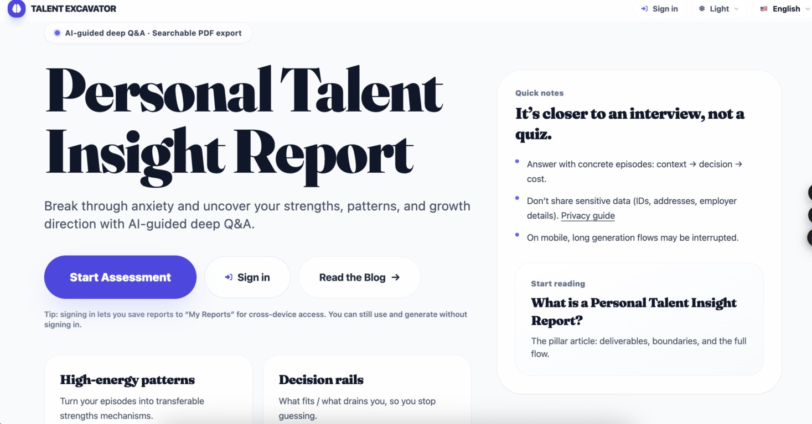

# Ming Li — Applied AI / Machine Learning Portfolio

Applied AI / Machine Learning Engineer with 20+ years of experience across speech, audio, music information retrieval, NLP, and LLM-based applications. My background spans research, large technology companies, startup environments, and independent AI product building.

This portfolio highlights selected recent projects that demonstrate my work in AI product design, system architecture, LLM application development, and end-to-end applied ML execution.

> Note: Some production code remains in private repositories because these projects are under active development or intended for commercial use. Public materials here focus on system design, product scope, technical architecture, and representative workflows.

---

## Quick Links

- LinkedIn: https://www.linkedin.com/in/ming-li-cas/
- GitHub Profile: https://github.com/treeson-li
- Live Product: https://www.bluetlas.com/
- Featured Projects:
  - DemandRadar
  - Outfitly
  - Talent Excavator

---

## What I Work On

- Applied machine learning systems
- LLM-based product workflows
- AI product prototyping and MVP design
- Speech, audio, and music-related ML applications
- End-to-end product thinking: architecture, evaluation, delivery, and monetization strategy

---

## Featured Projects

### 1. DemandRadar — AI-Powered Demand Discovery and Validation Tool

**One-line summary:** AI market-intelligence pipeline that turns community discussions into structured demand reports.

**Status:** Pre-launch  
**Role:** Founder / Applied AI Product Builder  
**Focus:** Market intelligence, community mining, demand clustering, report generation

DemandRadar is an AI-powered demand discovery tool designed to identify real user pain points and recurring demand signals from online communities such as Reddit and Hacker News. The system retrieves discussions, extracts user needs, clusters related signals, and generates structured insight reports for product exploration and validation.

#### What it does
- Mines public discussions from online communities
- Extracts demand-related signals from posts and comments
- Clusters recurring needs into higher-level topics
- Generates structured reports for product and market analysis

#### My contributions
- Designed the product concept and workflow from the ground up
- Built the core Python-based pipeline architecture
- Defined staged processing from retrieval to report generation
- Designed pricing direction and product strategy
- Managed third-party API selection and maintenance

#### Technical highlights
- Reproducible CLI-first pipeline
- Multi-stage workflow: retrieval → extraction → embedding → clustering → topic synthesis → report generation
- Structured artifacts and observability for debugging and iteration
- Designed for future web product extension

#### Tech stack
- Python
- LLM APIs
- Embedding workflows
- Clustering pipelines
- JSON/CLI artifact design
- Report generation pipeline

---

### 2. Outfitly — AI Fashion Assistant

**One-line summary:** Multimodal AI fashion assistant for outfit analysis, virtual try-on, and closet-based recommendations.

**Status:** MVP in progress  
**Role:** Founder / Product & AI Engineering Lead  
**Focus:** Multimodal AI, product design, mobile app architecture, personalized recommendations

Outfitly is an AI-powered fashion assistant app for the U.S. market. The product is designed to help users with outfit analysis, virtual try-on, digital closet management, and personalized styling recommendations.

#### What it does
- Analyzes outfits and style combinations
- Supports virtual try-on related workflows
- Organizes digital wardrobe / closet information
- Delivers personalized fashion recommendations

#### My contributions
- Conceived the product and defined core user scenarios
- Designed product architecture across client, backend, and AI components
- Led MVP feature design and implementation planning
- Defined subscription, quota, and monetization strategy
- Managed AI/API vendor selection and integration planning

#### Technical highlights
- Multimodal AI-oriented product workflow
- iOS client + Python/Firebase backend architecture
- Product design balancing user experience and model capability
- Commercialization-aware technical planning

#### Tech stack
- iOS app workflow
- Python
- Firebase
- Multimodal AI services
- Subscription / quota logic
- AI API integration

---

### 3. Talent Excavator — AI-Powered Personalized Insight Web App

**One-line summary:** Live AI web product that converts guided user conversations into personalized talent reports.

**Status:** Live  
**Live Site:** https://www.bluetlas.com/  

**Role:** Founder / AI Product Lead  
**Focus:** Conversational workflow, structured report generation, paid user flow

Talent Excavator is an AI-powered web application that guides users through multi-turn conversations and generates personalized talent insight reports. The product includes payment unlock, online reading, PDF export, and email delivery.

#### What it does
- Conducts guided multi-turn user interaction
- Produces personalized analysis reports
- Supports payment-based unlock flow
- Delivers results through web reading, PDF, and email

#### My contributions
- Designed the product and end-to-end user workflow
- Led architecture and core feature definition
- Integrated model/API workflow into the product experience
- Defined pricing and monetization logic
- Shipped the live product and supported early usage

#### Technical highlights
- AI-driven multi-step interaction flow
- Structured output generation
- Delivery pipeline across web, PDF, and email
- Product-oriented design from user interaction to paid conversion

#### Tech stack
- Web application architecture
- LLM/API integration
- Payment unlock workflow
- PDF generation
- Email delivery pipeline

---

## How I Approach AI Product Development

Across these projects, my work typically combines:

- Problem framing and product concept design
- Applied ML / LLM workflow design
- System architecture and implementation planning
- Model/API selection and evaluation
- Product delivery thinking, including monetization and user flow

I am particularly interested in roles that require strong applied AI judgment, end-to-end execution, and the ability to translate technical capability into working products.

---

## Additional Background

Before these independent projects, I spent 20+ years working across machine learning research and industry applications, including:

- Speech enhancement
- Speaker identification
- Music classification
- Query by humming
- Automatic music transcription
- LLM fine-tuning for educational QA

Selected past results include:
- Increased QQ Music feature usage by 60% through a query-by-humming system
- Reduced word error rate by 20%–30% on real in-car noisy speech
- Reduced automatic music transcription error by approximately 50%
- Won multiple MIREX championships in music information retrieval tasks

---

## Contact

I am currently open to remote opportunities in:
- Applied Machine Learning
- AI Engineering
- NLP / Speech / Audio ML
- LLM Application Development
- Contract / Consulting / Fractional AI roles

- LinkedIn: https://www.linkedin.com/in/ming-li-cas/
- GitHub: https://github.com/treeson-li
- Email: liming.ioa+2026@gmail.com
